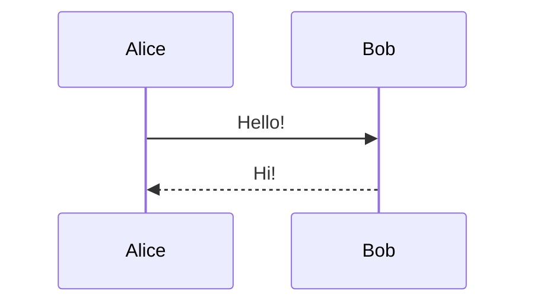

# Skill: presenterm — Terminal Slideshow Authoring

Write markdown-based terminal presentations using presenterm. This skill covers slide syntax, comment commands, code blocks, layouts, themes, configuration, exports, and speaker notes.

## Quick Start

Minimal presentation:

```markdown
---
title: My Presentation
author: Jane Doe
---

First Slide
===

Content here.

<!-- end_slide -->

Second Slide
===

More content.
```

Run: `presenterm slides.md`

Present (no hot-reload): `presenterm -p slides.md`

---

## Front Matter

YAML block between `---` fences at the top of the file. All fields optional. If `title`, `sub_title`, or `author`/`authors` is set, an intro slide is auto-generated.

```yaml
---
title: "My _formatted_ **title**"
sub_title: "A subtitle"
author: Jane Doe
# OR for multiple authors:
# authors:
#   - Jane Doe
#   - John Smith
event: "RustConf 2025"
location: "Portland, OR"
date: "2025-04-30"
theme:
  name: dark                    # built-in theme name
  # path: ./my-theme.yaml      # OR custom theme file
  # light: light                # OR auto-detect: light theme
  # dark: dark                  #                 dark theme
  override:                     # partial inline overrides
    default:
      colors:
        foreground: "beeeff"
    footer:
      style: template
      right: "{current_slide} / {total_slides}"
    palette:
      colors:
        red: "f78ca2"
      classes:
        highlight:
          foreground: red
options:
  implicit_slide_ends: false
  end_slide_shorthand: false
  h1_slide_titles: false
  command_prefix: ""
  incremental_lists: false
  strict_front_matter_parsing: true
  image_attributes_prefix: "image:"
  auto_render_languages: []       # e.g. [mermaid]
  list_item_newlines: 1
---
```

### Front matter field notes

- `title` and `sub_title` support inline markdown (`_italics_`, `**bold**`) and `<span>` tags.
- `author` and `authors` are mutually exclusive.
- `event`, `location`, `date` appear on the intro slide and are available as footer template variables.
- `theme.name`, `theme.path`, and `theme.light`/`theme.dark` are mutually exclusive selection methods.
- `theme.override` merges on top of the selected base theme.
- `options` override global config for this presentation only.

---

## Slide Structure

### Slide separators

| Method | Syntax | Requirement |
|--------|--------|-------------|
| Primary | `<!-- end_slide -->` | Always available |
| Shorthand | `---` (thematic break) | `end_slide_shorthand: true` |
| Implicit | Setext heading underline | `implicit_slide_ends: true` |

### Slide titles

**Setext headings** (underlined with `===` or `---`) render as styled, centered slide titles:

```markdown
My Slide Title
===
```

With `h1_slide_titles: true`, the first `# Heading` on a slide becomes the title instead.

Standard ATX headings (`#` through `######`) render as headings but are NOT slide titles by default.

---

## Comment Commands

All commands are HTML comments. If `command_prefix` is set (e.g. `"cmd:"`), prefix all commands accordingly (e.g. `<!-- cmd:pause -->`).

### Flow control

| Command | Effect |
|---------|--------|
| `<!-- end_slide -->` | End current slide, start new one |
| `<!-- pause -->` | Pause; next content revealed on keypress |
| `<!-- skip_slide -->` | Exclude this slide from the presentation |

### Spacing and positioning

| Command | Effect |
|---------|--------|
| `<!-- jump_to_middle -->` | Jump to vertical center of slide |
| `<!-- new_line -->` | Insert one blank line |
| `<!-- new_lines: N -->` | Insert N blank lines |

`newline` and `newlines` are accepted aliases.

### Layout

| Command | Effect |
|---------|--------|
| `<!-- column_layout: [3, 2] -->` | Define columns with proportional widths |
| `<!-- column: 0 -->` | Switch to column N (0-indexed) |
| `<!-- reset_layout -->` | Exit column layout, return to full width |
| `<!-- alignment: left -->` | Set text alignment (`left`, `center`, `right`) for rest of slide |

### Lists and tables

| Command | Effect |
|---------|--------|
| `<!-- incremental_lists: true -->` | Each bullet revealed one at a time (until end of slide) |
| `<!-- incremental_lists: false -->` | Disable incremental lists |
| `<!-- incremental_tables: true -->` | Each table row revealed one at a time |
| `<!-- incremental_tables: false -->` | Disable incremental tables |
| `<!-- list_item_newlines: N -->` | Set spacing between list items |

### Appearance

| Command | Effect |
|---------|--------|
| `<!-- no_footer -->` | Hide footer on this slide |
| `<!-- font_size: N -->` | Set font size 1-7 (kitty 0.40.0+ only) |

### Content inclusion

| Command | Effect |
|---------|--------|
| `<!-- include: other.md -->` | Include external markdown file inline |

### Code output placement

| Command | Effect |
|---------|--------|
| `<!-- snippet_output: my_id -->` | Place output of `+exec +id:my_id` snippet here |

### Speaker notes

```markdown
<!-- speaker_note: Single line note. -->

<!--
speaker_note: |
  Multi-line
  speaker note.
-->
```

Multiple notes per slide are allowed.

### User comments (ignored during rendering)

```markdown
<!-- comment: Any text here -->
<!-- // Any text here -->
```

---

## Code Blocks

### Basic syntax highlighting

~~~markdown
```rust
fn main() {
    println!("Hello");
}
```
~~~

50+ languages supported.

### Code block attributes

Attributes go after the language name, space-separated:

~~~markdown
```rust {1-4|6-10|all} +line_numbers +exec
code here
```
~~~

#### Display attributes

| Attribute | Effect |
|-----------|--------|
| `+line_numbers` | Show line numbers |
| `+no_background` | Render without code block background |

#### Line highlighting

| Syntax | Effect |
|--------|--------|
| `{1,3,5-7}` | Static: highlight specific lines/ranges |
| `{1,3\|5-7}` | Dynamic: highlight changes on keypress (`\|` separates frames) |
| `{all}` | Highlight all lines (useful as a dynamic frame) |

Example — three dynamic frames then all:

~~~markdown
```rust {1-4|6-10|12|all} +line_numbers
...
```
~~~

#### Execution attributes

| Attribute | Effect |
|-----------|--------|
| `+exec` | Executable with Ctrl+e. Requires `-x` flag or config `snippet.exec.enable: true` |
| `+exec:<executor>` | Execute with alternative executor (e.g. `+exec:rust-script`) |
| `+auto_exec` | Execute automatically when slide is shown |
| `+exec_replace` | Auto-execute; replace snippet with output. Requires `-X` flag or config |
| `+exec_replace:<executor>` | exec_replace with alternative executor |
| `+image` | Like `+exec_replace` but output is treated as binary image |
| `+acquire_terminal` | Suspend presenterm, give snippet the raw terminal |
| `+pty` | Run in pseudo-terminal (renders TUI output like `top`) |
| `+pty:<cols>:<rows>` | PTY with custom dimensions |
| `+pty:standby` | PTY area visible before execution |
| `+pty:standby:<cols>:<rows>` | PTY standby with custom dimensions |
| `+id:<name>` | Assign identifier for `<!-- snippet_output: name -->` placement. Only with `+exec` |
| `+env:<path>` | Load env vars from file before execution |

#### Validation attributes

| Attribute | Effect |
|-----------|--------|
| `+validate` | Not executable in presentation; validated with `--validate-snippets` |
| `+validate:<executor>` | Validate with alternative executor |
| `+expect:success` | Expect exit code 0 (default) |
| `+expect:failure` | Expect non-zero exit code |

#### Render attributes (diagrams and formulas)

| Attribute | Effect |
|-----------|--------|
| `+render` | Pre-render code block to image (for `latex`, `typst`, `mermaid`, `d2`) |
| `+width:N%` | Set rendered image width as percentage |

### Hidden lines in executable snippets

Lines included in execution but hidden from display:

| Languages | Hidden line prefix |
|-----------|--------------------|
| Rust | `# ` (hash + space) |
| Python, Bash, Fish, Shell, Zsh, Kotlin, Java, JavaScript, TypeScript, C, C++, Go | `/// ` (triple-slash + space) |

Example:

~~~markdown
```rust +exec
# use std::collections::HashMap;
fn main() {
    let mut map = HashMap::new();
    map.insert("key", "value");
    println!("{map:?}");
}
```
~~~

The `use` line executes but is not displayed.

### External file snippets

~~~markdown
```file +exec +line_numbers
path: snippet.rs
language: rust
start_line: 5
end_line: 10
```
~~~

`start_line` and `end_line` are optional.

### Alternative executors

| Language | Executor |
|----------|----------|
| Rust | `rust-script` |
| Python | `pytest`, `uv` |

Custom executors are defined in config under `snippet.exec.custom`.

### Rendered diagrams and formulas

#### Mermaid (requires `mmdc`)

~~~markdown

~~~

#### LaTeX (requires `typst` + `pandoc`)

~~~markdown
```latex +render
\[ E = mc^2 \]
```
~~~

#### Typst (requires `typst`)

~~~markdown
```typst +render +width:50%
$f(x) = integral_0^x t^2 dif t$
```
~~~

#### D2 (requires `d2`)

~~~markdown
```d2 +render
server -> database: query
database -> server: results
```
~~~

Use `auto_render_languages: [mermaid]` in options to skip `+render` for specific languages.

---

## Layout

### Column layouts

```markdown
<!-- column_layout: [3, 2] -->

<!-- column: 0 -->

Left column content (60% width).

<!-- column: 1 -->

Right column content (40% width).

<!-- reset_layout -->

Back to full width.
```

- Any number of columns. Widths are proportional.
- Centering trick: `<!-- column_layout: [1, 3, 1] -->` and write to column 1.
- Columns interact with `<!-- pause -->` — content in later columns can appear on subsequent keypresses.
- Toggle visual layout grid: press `T` during presentation.

### Text alignment

```markdown
<!-- alignment: center -->

This text is centered.
```

Values: `left`, `center`, `right`. Applies to remainder of slide.

### Vertical centering

```markdown
<!-- jump_to_middle -->

This content is vertically centered.
```

---

## Images

```markdown


```

- Paths are relative to the presentation file.
- Remote URLs are NOT supported.
- Protocols: kitty, iterm2, sixel (auto-detected). Falls back to ASCII blocks.

### Image sizing

```markdown


```

The `image:` prefix is configurable via `image_attributes_prefix`. Set to `""` to use ``.

---

## Text Formatting

### Standard markdown

- `**Bold**`, `_Italics_`, `**_Bold italic_**`, `~Strikethrough~`
- `` `Inline code` ``
- Ordered and unordered lists (nested supported)
- Block quotes: `> text`
- Tables, links, horizontal rules
- ATX headings `#` through `######`

### GitHub-style alerts

```markdown
> [!note]
> Informational note.

> [!tip]
> Helpful tip.

> [!important]
> Important information.

> [!warning]
> Warning message.

> [!caution]
> Dangerous action.
```

### Colored and styled text

Only `<span>` tags are supported. CSS limited to `color` and `background-color`.

```markdown
<span style="color: red">Red text</span>
<span style="color: #ff0000">Hex color</span>
<span style="color: blue; background-color: black">Styled</span>
<span style="color: palette:red">Using palette color</span>
<span style="color: p:red">Palette shorthand</span>
<span class="my_class">Using a palette class</span>
```

Palette colors and classes are defined in the theme under `palette:`.

---

## Themes

### Built-in themes

`dark`, `light`, `terminal-dark`, `terminal-light`, `catppuccin-latte`, `catppuccin-frappe`, `catppuccin-macchiato`, `catppuccin-mocha`, `gruvbox-dark`, `tokyonight-day`, `tokyonight-moon`, `tokyonight-night`, `tokyonight-storm`

Preview: `presenterm --list-themes`

### Theme selection (precedence: CLI > front matter > config)

1. **CLI:** `presenterm --theme dark slides.md`
2. **Front matter by name:** `theme: { name: dark }`
3. **Front matter by path:** `theme: { path: ./my-theme.yaml }`
4. **Front matter auto-detect:** `theme: { light: light, dark: dark }`
5. **Config default:** `defaults.theme: dark`

### Custom themes

Drop `.yaml` files in `~/.config/presenterm/themes/`. They become available by filename (without extension).

Custom syntax highlighting themes (`.tmTheme`) go in `~/.config/presenterm/themes/highlighting/`.

### Theme YAML reference

All keys are optional. Use `extends: <theme_name>` to inherit from another theme.

```yaml
extends: dark

default:
  margin:
    percent: 8              # or fixed: 4
  colors:
    foreground: "e6e6e6"    # hex or palette:<name> or p:<name>
    background: "040312"

slide_title:
  alignment: center         # left | center | right
  padding_top: 1
  padding_bottom: 1
  colors:
    foreground: palette:orange
  bold: true
  underlined: false
  italics: false
  font_size: 2              # 1-7, kitty only
  separator: true           # horizontal line below title
  prefix: ""                # text prefix before title

headings:
  h1:
    prefix: "██"
    colors:
      foreground: palette:blue
    bold: true
    underlined: false
    italics: false
  h2:
    prefix: "▓▓▓"
    colors:
      foreground: palette:light_green
  # h3 through h6 follow the same structure

intro_slide:
  title:
    alignment: center
    colors:
      foreground: palette:light_blue
    font_size: 2
  subtitle:
    alignment: center
    colors:
      foreground: palette:aqua
  author:
    alignment: center
    colors:
      foreground: "b6eada"
    positioning: page_bottom  # or below_title
  event:
    alignment: center
    colors:
      foreground: palette:light_blue
  location:
    alignment: center
    colors:
      foreground: palette:aqua
  date:
    alignment: center
    colors:
      foreground: palette:orange
  footer: false              # hide footer on intro slide

code:
  alignment: center          # left | center | right
  theme_name: base16-eighties.dark
  padding:
    horizontal: 2
    vertical: 1
  background: true
  line_numbers: false
  minimum_size: 50
  minimum_margin:
    percent: 8

inline_code:
  colors:
    foreground: "04de20"
    background: "455045"

execution_output:
  colors:
    foreground: palette:white
    background: palette:black
  status:
    running:
      foreground: palette:light_blue
    success:
      foreground: palette:light_green
    failure:
      foreground: palette:red
    not_started:
      foreground: palette:orange
  padding:
    horizontal: 2
    vertical: 1

pty_output:
  colors:
    foreground: palette:white
    background: palette:black
  cursor:
    highlight_colors:
      foreground: palette:black
      background: palette:white

block_quote:
  prefix: "▍ "
  colors:
    foreground: palette:light_gray
    background: palette:blue_gray
    prefix: palette:orange

alert:
  prefix: "▍ "
  base_colors:
    foreground: palette:light_gray
    background: palette:blue_gray
  styles:
    note:
      color: palette:blue
    tip:
      color: palette:light_green
    important:
      color: palette:purple
    warning:
      color: palette:orange
    caution:
      color: palette:red

footer:
  style: template            # template | progress_bar | empty
  left: "text or {variable}"
  center: "text or {variable}"
  right: "{current_slide} / {total_slides}"
  height: 3                  # rows; increase for images
  # For images in footer:
  # left:
  #   image: logo.png

typst:
  colors:
    foreground: palette:light_gray
    background: palette:blue_gray
  horizontal_margin: 2
  vertical_margin: 2

mermaid:
  background: transparent
  theme: dark

d2:
  theme: 200

bold:
  colors:
    foreground: "ffffff"     # optional global bold color
italics:
  colors:
    foreground: "ffffff"     # optional global italic color

modals:
  selection_colors:
    foreground: palette:orange

column_layout:
  margin:
    fixed: 4

layout_grid:
  color: palette:blue

palette:
  colors:
    blue: "3085c3"
    light_blue: "b4ccff"
    red: "f78ca2"
    orange: "ee9322"
  classes:
    highlight:
      foreground: red
      background: "000000"
```

### Color format

- Hex: `"ff0000"` (no `#` prefix)
- Palette reference: `palette:red` or `p:red`
- Named terminal colors in some contexts: `red`, `blue`, etc.

### Footer template variables

`{current_slide}`, `{total_slides}`, `{title}`, `{sub_title}`, `{author}`, `{event}`, `{location}`, `{date}`

### Footer with image

```yaml
footer:
  style: template
  left:
    image: logo.png
  right: "{current_slide} / {total_slides}"
  height: 5
```

### Progress bar footer

```yaml
footer:
  style: progress_bar
  character: "━"             # optional custom character
```

---

## Configuration

Config file location:
- Linux: `~/.config/presenterm/config.yaml`
- macOS: `~/Library/Application Support/presenterm/config.yaml`
- Windows: `~/AppData/Roaming/presenterm/config/config.yaml`
- Override: `presenterm -c /path/to/config.yaml` or `PRESENTERM_CONFIG_FILE` env var

### Key config sections

```yaml
defaults:
  theme: dark
  terminal_font_size: 16
  image_protocol: auto       # auto | kitty-local | kitty-remote | iterm2 | sixel
  max_columns: 100
  max_columns_alignment: center
  max_rows: 100
  max_rows_alignment: center
  validate_overflows: never   # never | always | when_presenting | when_developing
  incremental_lists:
    pause_before: true
    pause_after: true

options:
  # Same keys as front matter options (apply globally)
  implicit_slide_ends: false
  end_slide_shorthand: false
  h1_slide_titles: false
  command_prefix: ""
  incremental_lists: false
  auto_render_languages: []
  list_item_newlines: 1

snippet:
  exec:
    enable: true
    custom:
      c++:
        filename: "snippet.cpp"
        environment:
          MY_VAR: foo
        hidden_line_prefix: "/// "
        commands:
          - ["g++", "-std=c++20", "snippet.cpp", "-o", "snippet"]
          - ["./snippet"]
  exec_replace:
    enable: true
  render:
    threads: 2

typst:
  ppi: 300

mermaid:
  scale: 2

d2:
  scale: 2

speaker_notes:
  listen_address: "127.0.0.1:59418"
  publish_address: "127.0.0.1:59418"
  always_publish: false

export:
  dimensions:
    columns: 80
    rows: 30
  pauses: new_slide
  snippets: sequential
  pdf:
    fonts:
      normal: /path/to/font.ttf
      italic: /path/to/font-italic.ttf
      bold: /path/to/font-bold.ttf
      bold_italic: /path/to/font-bolditalic.ttf

transition:
  duration_millis: 750
  frames: 45
  animation:
    style: fade              # fade | slide_horizontal | collapse_horizontal

bindings:
  # Override default key bindings per action
```

---

## Speaker Notes

### Define in markdown

```markdown
<!-- speaker_note: This note appears in the speaker view. -->

<!--
speaker_note: |
  Multi-line notes
  with more detail.
-->
```

### Run with speaker notes

```bash
# Terminal 1: main presentation
presenterm --publish-speaker-notes slides.md
# or: presenterm -P slides.md

# Terminal 2: speaker notes view
presenterm --listen-speaker-notes slides.md
# or: presenterm -l slides.md
```

Auto-publish via config: `speaker_notes.always_publish: true`.

---

## Export

### PDF (requires `weasyprint`)

```bash
presenterm --export-pdf slides.md
presenterm -e slides.md -o output.pdf

# Quick run without installing weasyprint globally:
uv run --with weasyprint presenterm -e slides.md
```

### HTML (no extra dependencies)

```bash
presenterm --export-html slides.md
presenterm -E slides.md -o output.html
```

Export config (in `config.yaml`):

```yaml
export:
  dimensions:
    columns: 80
    rows: 30
  pauses: new_slide          # each pause becomes a new page/slide in export
```

---

## CLI Reference

| Flag | Short | Effect |
|------|-------|--------|
| `<path>` | | Presentation file |
| `--present` | `-p` | Presentation mode (disables hot reload) |
| `--theme <name>` | `-t` | Override theme |
| `--export-pdf` | `-e` | Export as PDF |
| `--export-html` | `-E` | Export as HTML |
| `--output <path>` | `-o` | Output path for export |
| `--enable-snippet-execution` | `-x` | Enable `+exec` snippets |
| `--enable-snippet-execution-replace` | `-X` | Enable `+exec_replace` snippets |
| `--publish-speaker-notes` | `-P` | Publish speaker notes |
| `--listen-speaker-notes` | `-l` | Listen for speaker notes |
| `--validate-snippets` | | Run all executable/validate snippets on load |
| `--validate-overflows` | | Check that slides fit terminal |
| `--image-protocol <proto>` | | Force image protocol |
| `--config-file <path>` | `-c` | Custom config file path |
| `--list-themes` | | Preview all built-in themes |
| `--list-comment-commands` | | List all comment commands |
| `--current-theme` | | Print active theme |

---

## Key Bindings (defaults)

| Action | Keys |
|--------|------|
| Next slide/step | `l`, `j`, `Right`, `PageDown`, `Down`, `Space` |
| Next (skip pauses/transitions) | `n` |
| Previous slide/step | `h`, `k`, `Left`, `PageUp`, `Up` |
| Previous (fast) | `p` |
| First slide | `gg` |
| Last slide | `G` |
| Go to slide N | `<N>G` |
| Execute code | `Ctrl+e` |
| Reload | `Ctrl+r` |
| Slide index | `Ctrl+p` |
| Key bindings help | `?` |
| Layout grid toggle | `T` |
| Skip all pauses | `s` |
| Close modal | `Esc` |
| Exit | `Ctrl+c`, `q` |
| Suspend | `Ctrl+z` |

All bindings are configurable in `config.yaml` under `bindings:`.

---

## Patterns and Examples

### Incremental bullet reveal

```markdown
<!-- incremental_lists: true -->

* First point
* Second point
* Third point
```

### Centered content with columns

```markdown
<!-- column_layout: [1, 3, 1] -->

<!-- column: 1 -->

This content is centered in the middle 60%.
```

### Image beside text

```markdown
<!-- column_layout: [3, 2] -->

<!-- column: 0 -->

Text content on the left.

* Point one
* Point two

<!-- column: 1 -->


```

### Custom intro slide (no front matter)

```markdown
<!-- newlines: 6 -->


My Presentation Title
====

<!-- alignment: center -->

<span style="color: blue">Author Name</span>

<!-- end_slide -->
```

### Footer with logo and slide numbers

```yaml
# In front matter theme.override or theme YAML:
footer:
  style: template
  left:
    image: logo.png
  center: '**My Talk** — _Conference 2025_'
  right: "{current_slide} / {total_slides}"
  height: 5
```

### Executable code with hidden setup

~~~markdown
```python +exec
/// import os
/// os.chdir("/tmp")
print("Current dir:", os.getcwd())
```
~~~

### Code output placed elsewhere

~~~markdown
```bash +exec +id:greeting
echo "Hello from a script!"
```

Some explanatory text between the code and its output.

<!-- snippet_output: greeting -->
~~~

### Dynamic code highlighting walkthrough

~~~markdown
```python {1-2|4-5|all} +line_numbers
import json
data = json.loads('{"key": "value"}')

for k, v in data.items():
    print(f"{k} = {v}")
```
~~~

---

## Common Mistakes

- **Using `#` prefix on hex colors in theme YAML.** Presenterm expects bare hex: `"ff0000"` not `"#ff0000"`.
- **Using `---` as slide separator without enabling it.** Set `end_slide_shorthand: true` in options first, otherwise `---` renders as a horizontal rule.
- **Forgetting `-x` flag for `+exec` snippets.** Code won't execute without `--enable-snippet-execution` or `snippet.exec.enable: true` in config.
- **Using remote image URLs.** Presenterm only supports local file paths for images.
- **Mixing `author` and `authors` in front matter.** These are mutually exclusive.
- **Expecting `<!-- pause -->` in exports.** By default pauses are ignored in exports. Set `export.pauses: new_slide` to make each pause a separate page.
